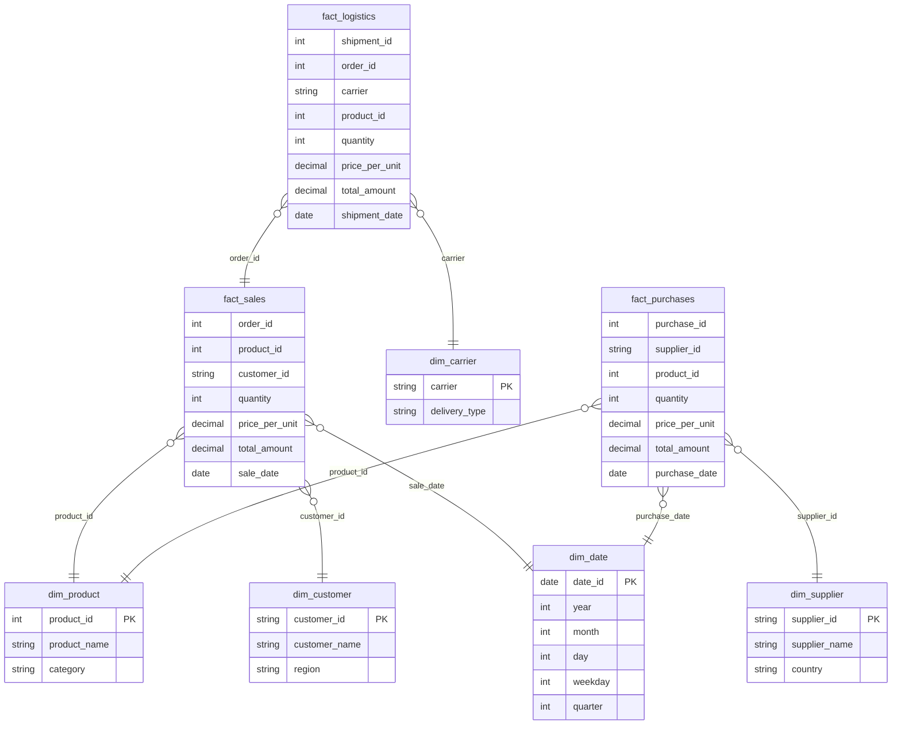

# Набросок star-схемы

```mermaid
erDiagram
    fact_sales }o--|| dim_product : product_id
    fact_sales }o--|| dim_customer : customer_id
    fact_sales }o--|| dim_date : sale_date
    fact_logistics }o--|| fact_sales : order_id
    fact_logistics }o--|| dim_carrier : carrier
    fact_purchases }o--|| dim_product : product_id
    fact_purchases }o--|| dim_supplier : supplier_id
    fact_purchases }o--|| dim_date : purchase_date

    fact_sales {
        int order_id
        int product_id
        string customer_id
        int quantity
        decimal price_per_unit
        decimal total_amount
        date sale_date
    }
    fact_purchases {
        int purchase_id
        string supplier_id
        int product_id
        int quantity
        decimal price_per_unit
        decimal total_amount
        date purchase_date
    }
    fact_logistics {
        int shipment_id
        int order_id
        string carrier
        int product_id
        int quantity
        decimal price_per_unit
        decimal total_amount
        date shipment_date
    }
    dim_product {
        int product_id PK
        string product_name
        string category
    }
    dim_customer {
        string customer_id PK
        string customer_name
        string region
    }
    dim_supplier {
        string supplier_id PK
        string supplier_name
        string country
    }
    dim_carrier {
        string carrier PK
        string delivery_type
    }
    dim_date {
        date date_id PK
        int year
        int month
        int day
        int weekday
        int quarter
    }
```
